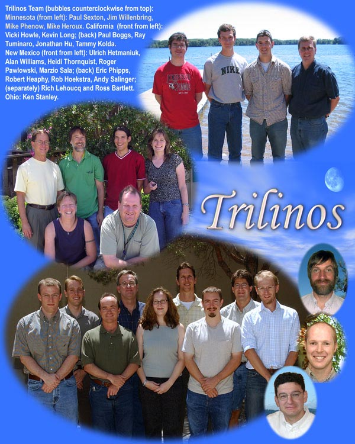

The Trilinos Project is a community-driven, open-source software framework designed to enable scalable scientific computing for complex engineering and scientific problems. It provides a modular collection of reusable libraries, known as packages, that support the development of high-performance algorithms for solving linear and nonlinear systems of equations, eigensystems, optimization problems, and uncertainty quantification. Trilinos is widely used in applications requiring robust and scalable solutions across diverse hardware architectures, from desktops to leadership-class supercomputers.

Originally developed at [Sandia National Laboratories](https://www.sandia.gov/) in 2001, Trilinos has grown significantly and now encompasses nearly 40 packages, each contributing unique [capabilities](capabilities.html). The project emphasizes scalability, interoperability, and accessibility, fostering collaboration among developers and users.

In May 2024, Trilinos became part of the [Linux Foundation](https://www.linuxfoundation.org/) and [High Performance Software Foundation](https://hpsf.io/) (HPSF), marking a significant milestone in its commitment to fostering open-source collaboration, enhancing [governance](community.html#trilinos-and-hpsf) practices, and advancing scalable scientific computing solutions for modern high-performance computing (HPC) architectures. This partnership ensures long-term sustainability and broader community engagement for the Trilinos Project.

---

## Key Features

- **Parallel Computing Support**: Optimized for high-performance computing environments, supporting MPI, OpenMP, and other parallel execution models.
- **Wide Range of Solvers**: Includes linear, nonlinear, eigenvalue, and optimization solvers to address diverse computational challenges.
- **Modular Architecture**: Composed of individual packages that can be used independently or integrated seamlessly to build custom solutions.
- **Advanced Tools**: Offers capabilities for discretization, mesh manipulation, automatic differentiation, and uncertainty quantification.
- **Performance Portability**: Achieved through the Kokkos ecosystem, enabling efficient execution across distributed, multicore, accelerator, and vectorized computing devices.

---

## Who Should Use Trilinos?

Trilinos is ideal for:
- Researchers and engineers working on scientific computing problems.
- Developers building scalable applications for high-performance computing environments.
- Teams seeking modular and extensible tools for numerical analysis and simulation.

---

## Trilinos Philosophy

Trilinos is built on a federated model of software development, emphasizing collaboration, modularity, and autonomy. Each package is developed by a focused team, allowing for specialization and innovation while adhering to common standards for interoperability and software quality.

Key principles include:
- **Modularity**: Packages are semi-autonomous, with well-defined capabilities and interfaces.
- **Interoperability**: Designed to work seamlessly together, enabling users to combine capabilities algorithmically.
- **Scalability**: Optimized for parallel computing environments, ensuring efficient performance as problem sizes and processor counts increase.
- **Accessibility**: Available across major programming environments (C++, Fortran, Python) and portable across diverse hardware architectures.

The Trilinos philosophy also emphasizes rigorous software engineering practices, including thorough testing, comprehensive documentation, and a lean/agile lifecycle model. This ensures Trilinos remains robust, maintainable, and adaptable to emerging challenges in scientific computing.

---

## Targeted Platforms and Architectures

Trilinos supports all major parallel computing architectures:
- **Distributed Memory Systems**: Using MPI for communication.
- **Multicore Architectures**: Leveraging OpenMP, Pthreads, and TBB for shared-memory parallelism.
- **Accelerators**: Supporting GPU-based systems through CUDA, HIP, and SYCL, as well as emerging hardware technologies.
- **Vectorization**: Optimized for vectorized computing to maximize performance on modern processors.

Performance portability is achieved through the Kokkos ecosystem, which provides abstractions for parallel execution and memory management.

---

## Awards and Recognition

### R&D 100 Award (2004)
Trilinos received a prestigious R&D 100 Award in 2004, recognizing it as one of the "100 most technologically significant products introduced in the past year." 


### SC2004 HPC Software Challenge Award
Trilinos was awarded one of two HPC Software Challenge Awards at SC2004 for its commitment to professional software engineering practices and processes. 

---

## Citing Trilinos

If you are using Trilinos, please cite our software in your publications. Below is a suitable BibTeX entry:

```bibtex
@Manual{trilinos,
  title        = {The {T}rilinos {P}roject},
  author       = {The Trilinos Project Team},
  organization = {Linux Foundation / High Performance Software Foundation},
  year         = {2026},
  url          = {https://trilinos.github.io},
  note         = {Accessed: January 8, 2026},
}
```

For specific packages, you may cite their individual webpages. For example:
```
@Manual{muelu,
  title  = {The {M}uelu {P}roject},
  author = {The {M}uelu {T}eam}},
  year   = {2026},
  url    = {https://trilinos.github.io/docs/muelu/index.html}
  note   = {Accessed: January 8, 2026},
}
```

---

## License and Copyright

Trilinos is a collection of open-source packages licensed under multiple open-source licenses, primarily [BSD 3-Clause](https://spdx.org/licenses/BSD-3-Clause.html) and [LGPL](https://spdx.org/licenses/LGPL-2.1-or-later.html). [License](https://github.com/trilinos/Trilinos/blob/master/LICENSE) and [copyright](https://github.com/trilinos/Trilinos/blob/master/COPYRIGHT) information is provided at the root of the Trilinos repository and within individual package directories (e.g., Tpetra's [license](https://github.com/trilinos/Trilinos/blob/master/packages/tpetra/LICENSE) and [copyright](https://github.com/trilinos/Trilinos/blob/master/packages/tpetra/COPYRIGHT).

For more information for Trilinos developers, refer to [Guidance on Copyrights and Licenses](https://github.com/trilinos/Trilinos/wiki/Guidance-on-Copyrights-and-Licenses).

---

## Trilinos Logos

For Trilinos logos, visit the [Trilinos Logos Repository](https://github.com/trilinos/Logos).

## Contacts

For support, visit the [Support page](support.html).

## Feedback

We value your feedback! Please share your <a class="email" title="Submit feedback" href="#" onclick="javascript:window.location='mailto:{{site.feedback_email}}?subject={{site.feedback_subject_line}} Feedback&body=I have some feedback about ... %0A';"><i class="fa fa-envelope-o"></i> thoughts or suggestions</a> about the Trilinos Homepage.

